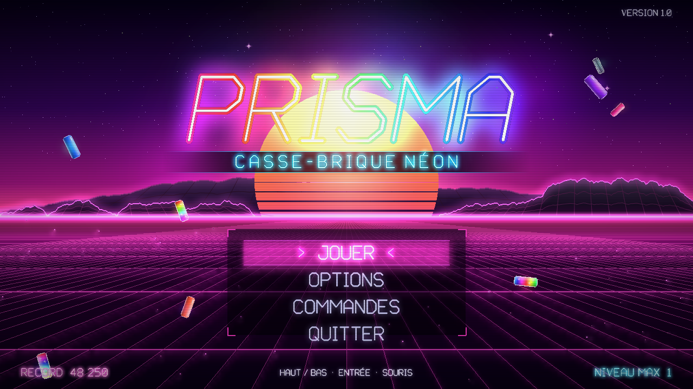
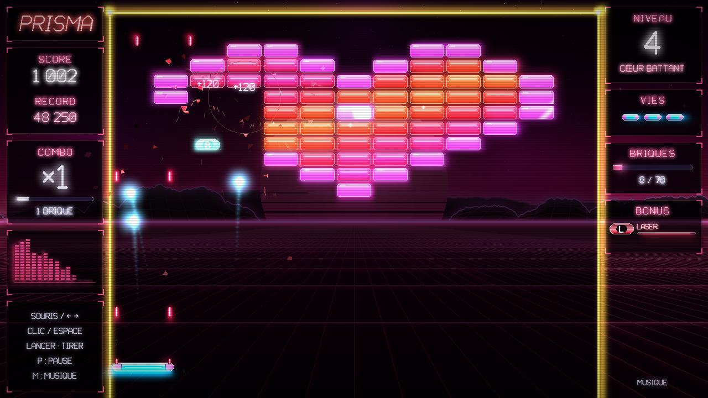
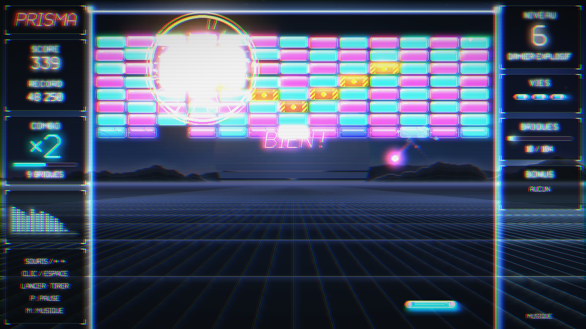
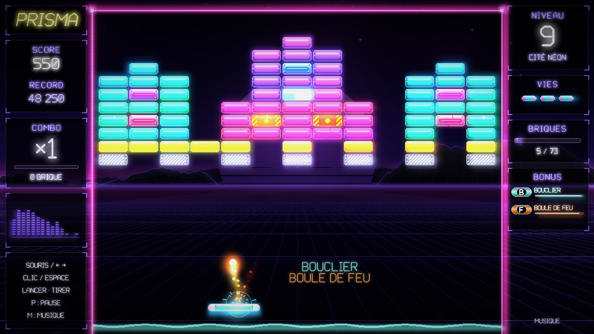

# PRISMA — casse-brique néon

Un casse-brique en Python / pygame à la direction artistique **synthwave** poussée au maximum :
néons chatoyants, soleil rayé, grille infinie, bloom, effet CRT, explosions en chaîne,
et une bande-son entièrement **synthétisée par le code** (aucun fichier image ni audio).



| Niveau 4 — Cœur battant | Niveau 6 — réaction en chaîne | Niveau 9 — Cité néon |
|---|---|---|
|  |  |  |

## Lancer le jeu

Python 3.9 ou plus récent.

```bash
pip install -r requirements.txt
python main.py            # ou : python -m casse_brique
```

`pygame-ce` est recommandé (bien plus rapide pour les effets de mélange) ; le `pygame`
classique fonctionne aussi. Le premier lancement synthétise les sons (~0,5 s) ; la musique
est générée en arrière-plan pendant l'écran titre.

## Commandes

| Action | Clavier / souris | Manette |
|---|---|---|
| Déplacer la raquette | Souris, `←` `→`, `Q` `D` (ou `A` `D`) — `Maj` pour aller plus vite | Stick gauche / croix |
| Lancer la balle, tirer au laser | Clic gauche, `Espace` | A |
| Pause | `P`, `Échap` | Start |
| Couper / remettre la musique | `M` | |
| Plein écran | `F11` (ou `Alt+Entrée`) | |
| Afficher les FPS | `F3` | |
| Capture d'écran (dans le dossier personnel) | `F12` | |

## Règles

- Enchaînez les briques **sans toucher la raquette** pour faire monter le combo :
  le multiplicateur gagne ×1 toutes les 6 briques (jusqu'à ×8), et la note jouée par
  chaque brique monte sur une gamme pentatonique.
- Une vie bonus tous les 30 000 points. Les niveaux 1 à 10 sont dessinés à la main,
  puis le **mode infini** génère des tableaux symétriques de plus en plus corsés.

### Briques

| Brique | Effet |
|---|---|
| Simple | 1 coup |
| Renforcée | 2 coups (se fissure) |
| Blindée | 3 coups |
| Métal | Indestructible |
| Explosive | Détruit ses 8 voisines — **réactions en chaîne** |
| Prisme | Irisée, libère toujours un bonus |

### Bonus (capsules)

| Capsule | Effet |
|---|---|
| **G** Grande raquette | Raquette élargie |
| **M** Multi-balle | Chaque balle se divise en trois |
| **L** Laser | Tir laser (Espace / clic) |
| **R** Ralenti | Balles ralenties |
| **F** Boule de feu | La balle traverse les briques |
| **A** Aimant | La balle colle à la raquette |
| **B** Bouclier | Barrière d'énergie sous la raquette |
| **♥** Vie +1 | Une vie supplémentaire |
| **P** Mini raquette | Malus : raquette réduite |
| **V** Accélération | Malus : balles plus rapides |

## Direction artistique

- **Décor synthwave animé** : ciel en dégradé, nébuleuses, étoiles scintillantes et
  filantes, soleil rayé dont les bandes défilent, montagnes filaires, grille en perspective
  qui défile et pulse au rythme de la musique. 10 thèmes de couleurs (Couchant, Cyber,
  Toxique, Passion, Inferno, Glacier, Vapeur, Prisme, Minuit, Supernova).
- **Police vectorielle « tube néon »** dessinée à la main (accents compris) : halo flouté,
  tube coloré, cœur lumineux. Logo parcouru par un arc-en-ciel, allumage façon enseigne.
- **Briques chatoyantes** : verre brillant, teinte qui ondule sur tout le mur, reflet qui
  balaie le mur, paillettes, halo néon ; elles tombent en rebondissant à chaque niveau et
  vibrent quand leurs voisines explosent.
- **Effets** : bloom multi-échelle, lignes de balayage et vignettage CRT, aberration
  chromatique, glitch, secousses d'écran, arrêt sur image, ralenti sur la dernière brique,
  flashs, ondes de choc, éclats, étincelles, braises, fumée, confettis, feux d'artifice,
  traînées de comète dont la couleur suit le combo.
- **Interface** : cartes de verre sombre, jauges néon, visualiseur de spectre synchronisé
  sur la musique, textes flottants, menus navigables clavier / souris / manette.

## Son

Tout est calculé au lancement avec numpy : oscillateurs anti-repliement (PolyBLEP),
filtres par FFT, réverbération par convolution, écho ping-pong, compression « sidechain ».

- **Effets** : rebonds, carillons de briques (gamme pentatonique selon le combo), métal,
  explosions, lasers, bonus/malus, fanfares, feux d'artifice… avec panoramique stéréo selon
  la position à l'écran et variantes de hauteur.
- **Musique** : deux morceaux synthwave (« Nuit néon » en la mineur à 100 BPM, « Horizon »
  en do mineur à 112 BPM) qui alternent d'un niveau à l'autre en fondu enchaîné. Chacun est
  découpé en trois pistes (nappes + basse, batterie, arpèges + mélodie) dont le mixage
  change selon la situation : menu, introduction de niveau, jeu, pause, fin de partie.

## Options et sauvegarde

Menu **Options** : volume de la musique et des effets, effet CRT, secousses d'écran
(accessibilité), plein écran. Les réglages et records sont enregistrés dans
`~/.prisma_casse_brique.json` (chemin modifiable avec la variable `PRISMA_SAVE`).
Si la machine peine à suivre, le jeu désactive de lui-même les effets les plus coûteux.

## Organisation du code

```
main.py                 point d'entrée
casse_brique/
  app.py                fenêtre, boucle, entrées (clavier/souris/manette), transitions, post-traitement
  scenes.py             écran titre, options, aide
  game.py               scène de jeu : physique à pas fixe, collisions, bonus, combos, HUD
  entities.py           briques, balles, raquette, capsules, lasers
  levels.py             niveaux dessinés + générateur procédural
  background.py         décor synthwave et thèmes
  sprites.py            génération des sprites (briques, raquette, balle, capsules)
  particles.py          système de particules
  post.py               bloom, CRT, aberration chromatique, glitch, secousses/ralenti
  vfont.py              police vectorielle néon
  audio.py              synthèse des sons et de la musique, mixage dynamique
  surf.py, util.py      outils graphiques et mathématiques
  ui.py, settings.py    menus et sauvegarde
tests/                  tests sans écran ni carte son
```

## Tests

```bash
python -m unittest discover -s tests -v
```

Les tests tournent sans écran ni carte son (pilotes SDL « dummy ») : grilles des niveaux,
sauvegarde, balle rapide qui ne traverse jamais le métal, rebond entre deux briques,
partie longue en pilote automatique, réaction en chaîne, combos, bonus, enchaînement
titre → jeu → game over, synthèse audio.
